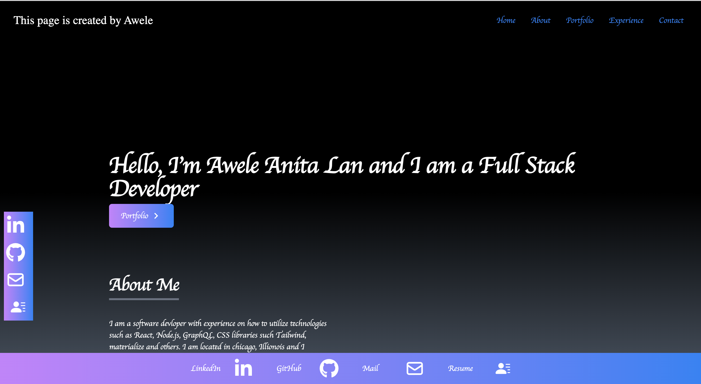
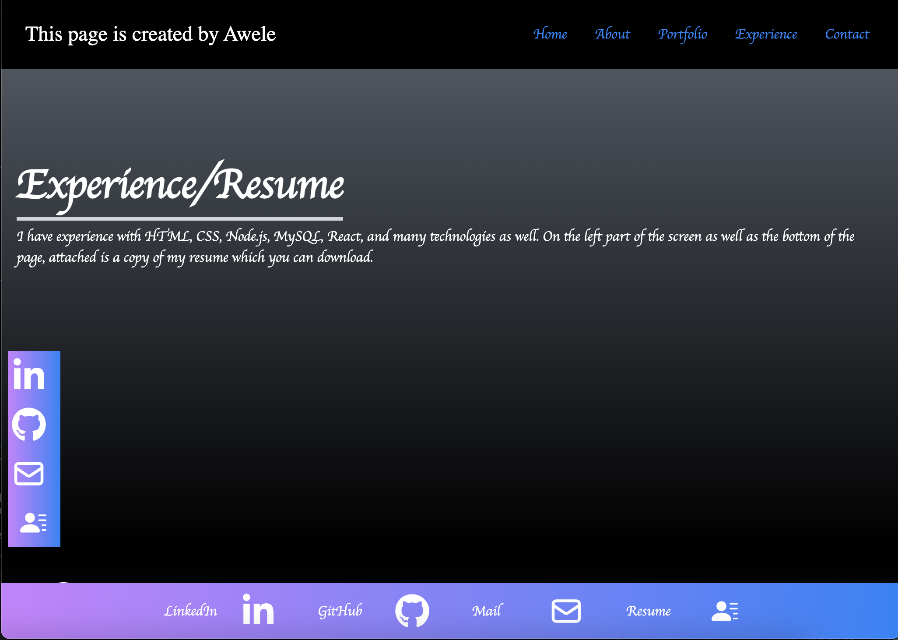
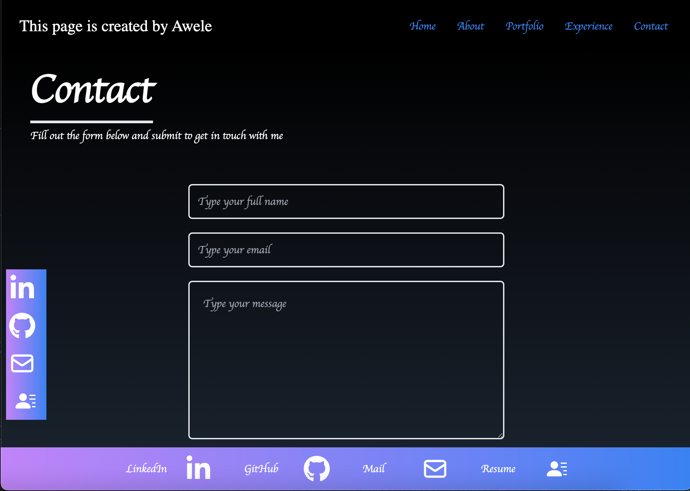

# React-Portfolio

## Description

The goal of this project is to create a React portfolio application where employers are able to view my portfolio of work samples with my Contact information, Resume available for download and a brief About section of myself while also making the page as user-interactive as possible.

## Table of Contents

- [Installation](#installation)
- [Usage](#usage)
- [Credits](#credits)
- [Features](#features)

## Installation

This page was accomplished with technologies such as React. In order to add features to the application, I worked on adding features in the component folder of my react. I also utilised react icons. I utilized Tailwind which is a css library as well in order to create the application.

## Usage
Usage of my web application is done when the portfolio is loaded. Afterwards, user is presented with a page containing a header, a section for content, and a footer which allows the user to view my name and navigation with titles corresponding to different sections of the portfolio. The user is also able to view the titles About, Portfolio, Contact, and Experience/Resume, and the title corresponding to the current section is highlighted
 a navigation title is clicked.

The Portfolio section contains titled images of six of my applications with links to both the deployed applications and the corresponding GitHub repositories.

The Contact section displays a contact form with fields for a name, an email address, and a message.

The Resume section enables user to access a downloadable resume.

The Footer section presents user with text or icon links to the my GitHub and LinkedIn profiles (I do not have one at the moment , however, the link provided directs user to linkedIn). I also do not have a twitter at the moment that I am able to direct user to. However, My Github profile link is attached.

Below, are screenshots of how my web application currently looks like:

    

## Credits

Class-activities.

## Features

Features about my project include:

- Navigation with titles corresponding to different sections of the portfolio.
- An about me section with recent photo & short bio.
- A portfolio section with titled images of six applications with links to both desployed applications and corresponding Github repositories.
- Contact section with contact form that includes fields for a name, an email address, and a message.
- Experience/Resume section that includes link to downloadable resume
- Footer that includes icon links to Github and LinkedInprofiles. At the moment, I do not have a linked in profile so i just attached the link to the general Linkedin page. I also do not have a twitter account. However, My Github profile link is attached.

## Links
Code link: https://github.com/Awele1111/React-Portfolio

Demo link: https://awele1111.github.io/React-Portfolio/

